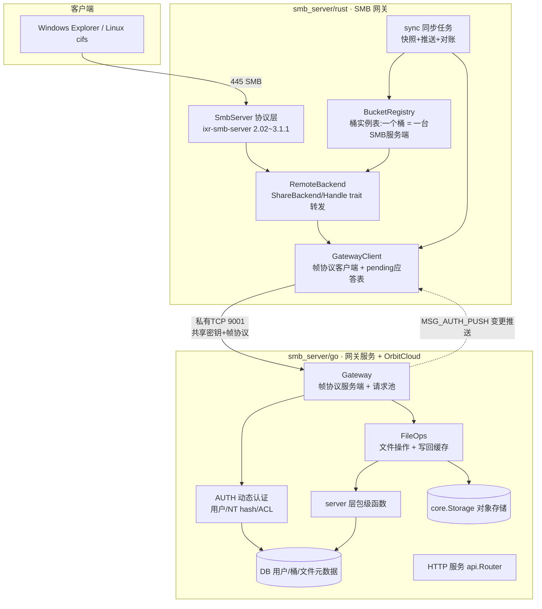

# SMB 网关设计文档 · 总览

> 面向后来维护者:本系列文档描述 `smb_server/`(Go + Rust 双侧)SMB 网关的全部设计:帧协议、连接生命周期、请求-响应流程、桶实例注册表、文件操作与流式、动态认证与配置。
> 当前阶段为**伪代码级设计**:结构/签名/协议已定稿,函数体为占位(Go `errNotImplemented` / Rust `Err("伪代码:未实现")`),按各篇文档的"真实现步骤"落地即可。

## 1. 架构总览



## 2. 设计原则(为什么这样做)

| 原则 | 说明 | 出处 |
| --- | --- | --- |
| 控制面/数据面分离 | 操作参数走 JSON(总操作 JSON,单次反序列化);文件数据走流数据段 / `io.Reader` | `01-frame-protocol.md`、`05-file-ops-streaming.md` |
| 一个桶 = 一台 SMB 服务端 | 桶实例注册表动态映射"连接意图 → 实例",经 Go 推送同步 | `04-bucket-registry-sync.md` |
| 被动服务端 / 主动客户端 | Go 侧只应答 + 只推送;Rust 侧全主动请求,方向单一 | `02-connection-lifecycle.md`、`03-request-response-flow.md` |
| 流式不整文件进内存 | 单帧 = 单块(≤1MiB);块内 `io.CopyN` 流式搬运;大文件 = 多帧迭代 | `05-file-ops-streaming.md` |
| 配置即契约 | 双侧配置镜像(config.yaml ↔ SMBGatewayConfig),`-WithConfig` JSON 注入无配置启动 | `06-auth-config.md` |

## 3. 目录结构

```text
smb_server/
├── go/                      # Go 侧网关组件(package smbgateway,无 main,由根 main.go 集成)
│   ├── wire.go              # 装配与配置(集成入口、SMBGatewayConfig、JSON 注入)
│   ├── gateway.go           # 帧协议服务端:连接/心跳/握手/请求池/OperateHandler 实现
│   ├── auth.go              # 动态认证:用户/NT hash/ACL 查询与变更推送
│   ├── file_ops.go          # 文件操作:open/read/write/list/unlink/rename/stat + 写回缓存
│   └── types.go             # 帧协议 + 总操作 JSON(OperateRequest/Response)+ 共享类型
└── rust/                    # Rust 侧网关(cargo 工程 smb-gateway)
    ├── Cargo.toml / Cargo.lock / config.yaml
    └── src/
        ├── main.rs          # 入口:日志/配置/连接网关/SMB 服务器/同步任务
        ├── types.rs         # 帧协议 + 总操作 JSON(与 Go 侧镜像)+ 测试
        ├── remote_backend.rs# GatewayClient(帧客户端)+ RemoteBackend/RemoteHandle(trait 转发)
        ├── registry.rs      # 桶实例注册表(一个桶 = 一台 SMB 服务端)
        ├── sync.rs          # 同步编排(快照/推送/对账,驱动注册表)
        ├── core/            # 全局配置结构(core/enter.rs)
        └── flag/            # 配置读取解析与命令行(flag/enter.rs,--WithConfig)
```

## 4. 文档索引

| 文档 | 内容 | 建议阅读顺序 |
| --- | --- | --- |
| [01-frame-protocol.md](01-frame-protocol.md) | 帧头、消息类型、总操作 JSON、流数据段、错误码、两侧一致性 | 1 |
| [02-connection-lifecycle.md](02-connection-lifecycle.md) | 握手、心跳、断线重连、优雅停机、连接状态机 | 2 |
| [03-request-response-flow.md](03-request-response-flow.md) | Go 分发/路由、Rust call/pending 应答、时序图 | 3 |
| [04-bucket-registry-sync.md](04-bucket-registry-sync.md) | 桶实例注册表、同步状态机、快照/推送/对账 | 4 |
| [05-file-ops-streaming.md](05-file-ops-streaming.md) | 文件操作、写回缓存、io.Reader 流式协调 | 5 |
| [06-auth-config.md](06-auth-config.md) | 动态认证(NT hash/ACL)、配置项、JSON 注入、双服务 | 6 |

## 5. 两侧对应关系(维护必看)

| 概念 | Go 侧 | Rust 侧 |
| --- | --- | --- |
| 帧头 | `types.go` `FrameHeader` | `types.rs` `FrameHeader` |
| 消息类型常量 | `MSG_*` | `MSG_*`(数值一致) |
| 操作码 | `OperateCode` + `Code*` | `OperateCode` + `CODE_*`(数值一致) |
| 总操作请求 | `OperateRequest` + `Route()` | `OperateRequest`(serde camelCase) |
| 总响应 | `OperateResponse` | `OperateResponse` |
| 错误哨兵 | `ErrCode*` | `ERR_*`(数值一致) |
| 桶实例表 | 无(权威源在 DB) | `registry.rs` `BucketRegistry` |
| 推送 | `AclEntry`(Go→Rust) | `AclEntry` |

> **一致性保障**:`types.rs` 内置单测(`frame_constants_match_go_side` / `operate_codes_match_go_side` / `error_codes_are_distinct`)断言常量与 Go 侧一致;修改任何常量表必须同步两侧并跑测试。
