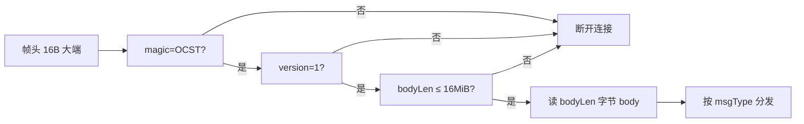
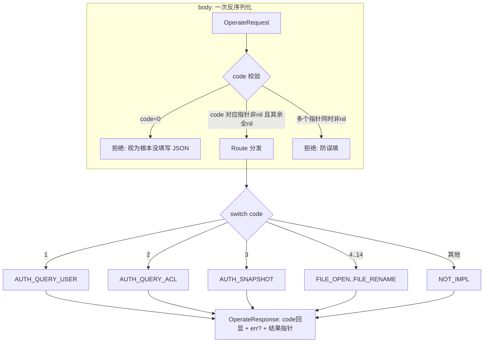

# SMB 网关设计文档 · 01 帧协议

> 帧协议是 Go/Rust 双侧唯一通信契约。**修改任何字段必须两侧同步,并跑 `types.rs` 常量测试。**

## 1. 帧头(16 字节,大端序)

```text
offset  size  字段
------  ----  --------------------------------------------------
0       4     magic   = 0x4F435354("OCST")——快速丢弃非本协议连接
4       1     version = 1
5       1     flags   : 0x01=响应帧 | 0x02=需响应(请求) | 0x04=心跳
6       2     msgType 消息类型(见 §3)
8       4     seq     请求序列号(响应原样带回;0=单向通知,无响应)
12      4     bodyLen payload 字节数(≤ 16 MiB)
```



## 2. 消息体布局

```text
MSG_OPERATE / MSG_OPERATE_RESP:
  body = [4B jsonLen u32 大端] + 总操作/总响应 JSON + [流数据段(仅 Read/Write)]

其余消息(握手/心跳/推送):body = JSON 或空
```

- 纯 JSON 操作:`jsonLen == bodyLen`,无流数据段;
- 带数据操作(Write 请求 / Read 响应):`dataLen = bodyLen - 4 - jsonLen`,**帧边界即数据边界**,一帧 = SMB 一块(≤1MiB)。

## 3. 消息类型

| msgType | 方向 | 说明 |
| --- | --- | --- |
| `0x0001` MSG_HELLO | Rust→Go | 握手请求(HelloRequest) |
| `0x0002` MSG_HELLO_ACK | Go→Rust | 握手应答(HelloResponse) |
| `0x0003` MSG_HEARTBEAT | 双向 | 心跳(单向帧) |
| `0x0015` MSG_AUTH_PUSH | Go→Rust | 变更推送(AclEntry,单向无响应) |
| `0x0201` MSG_OPERATE | Rust→Go | 控制面总操作请求 |
| `0x0202` MSG_OPERATE_RESP | Go→Rust | 控制面总响应 |
| `0x8001` MSG_ERR_RESP | Go→Rust | 协议级错误兜底(ErrorEnvelope) |

> 控制面统一走 OPERATE/OPERATE_RESP,内部用操作码路由(§4);没有独立的 `MSG_FILE_*` 系列,旧设计已废弃。

## 4. 总操作 JSON(控制面核心)



### 操作码表(0 为未填写哨兵,禁止使用)

| 操作码 | 常量 | 参数 | 结果 | 流数据段 |
| --- | --- | --- | --- | --- |
| 0 | CodeInvalid | — | — | — |
| 1 | CodeAuthQueryUser | AuthUserArgs | AuthUserResult | 无 |
| 2 | CodeAuthQueryAcl | AuthAclArgs | AuthAclResult | 无 |
| 3 | CodeAuthSnapshot | SnapshotArgs | SnapshotResult | 无 |
| 4 | CodeFileOpen | OpenArgs | OpenResult | 无 |
| 5 | CodeFileRead | ReadArgs | ReadResult | **响应携带** |
| 6 | CodeFileWrite | WriteArgs | WriteResult | **请求携带** |
| 7 | CodeFileFlush | FlushArgs | — | 无 |
| 8 | CodeFileStat | StatArgs | StatResult | 无 |
| 9 | CodeFileSetTimes | SetTimesArgs | — | 无 |
| 10 | CodeFileTruncate | TruncateArgs | — | 无 |
| 11 | CodeFileListDir | ListDirArgs | ListDirResult | 无 |
| 12 | CodeFileClose | CloseArgs | — | 无 |
| 13 | CodeFileUnlink | UnlinkArgs | — | 无 |
| 14 | CodeFileRename | RenameArgs | — | 无 |

### 请求/响应结构(Go `types.go` / Rust `types.rs` 镜像)

```text
OperateRequest {
  code: OperateCode,
  authUser?: AuthUserArgs, authAcl?: AuthAclArgs, snapshot?: SnapshotArgs,
  open?: OpenArgs, read?: ReadArgs, write?: WriteArgs, flush?: FlushArgs,
  stat?: StatArgs, setTimes?: SetTimesArgs, truncate?: TruncateArgs,
  listDir?: ListDirArgs, close?: CloseArgs, unlink?: UnlinkArgs, rename?: RenameArgs,
}
OperateResponse {
  code: OperateCode,           // 回显
  err?: ErrorEnvelope,         // 业务错误(哨兵 code)
  authUser?: ..., authAcl?: ..., snapshot?: ...,
  open?: OpenResult, read?: ReadResult, write?: WriteResult,
  stat?: StatResult, listDir?: ListDirResult,
  // Flush/SetTimes/Truncate/Close/Unlink/Rename 无结果字段:仅 code+err
}
```

- Rust 侧字段 `#[serde(rename_all = "camelCase")]`,与 Go json tag 完全一致;
- 结果字段为 `Option`,未命中操作的字段保持 None。

## 5. 错误哨兵(ErrCode / ERR_*)

| code | 含义 | 映射 SMB NTSTATUS |
| --- | --- | --- |
| 0 | 成功 | — |
| 1 | NotFound | OBJECT_NAME_NOT_FOUND |
| 2 | AccessDenied | ACCESS_DENIED |
| 3 | Exists | OBJECT_NAME_COLLISION |
| 4 | NotEmpty | DIRECTORY_NOT_EMPTY |
| 5 | IsDirectory | FILE_IS_A_DIRECTORY |
| 6 | NotADirectory | NOT_A_DIRECTORY |
| 7 | Io | UNEXPECTED_IO_ERROR |
| 8 | NotImpl | NOT_IMPLEMENTED(伪代码占位) |
| 9 | BadAuth | LOGON_FAILURE |
| 10 | GatewayDown | (连接层) |
| 11 | Timeout | (连接层) |
| 12 | BadRequest | (请求不合法:Code=0/指针不匹配) |

- **业务错误**进 `OperateResponse.err`,不回 `MSG_ERR_RESP`;
- `MSG_ERR_RESP` 仅用于协议级问题(未知 msgType、请求池背压、停机广播)。

## 6. 维护注意

1. 新增操作 = 两侧各改 5 处:操作码常量、Args 结构、Result 结构、OperateRequest/Response 字段、Route/handler 分支;
2. 常量测试(`types.rs`)会兜底数值漂移;
3. 流数据段只允许出现在 Read/Write,禁止其他操作携带(校验见 `Route`)。
