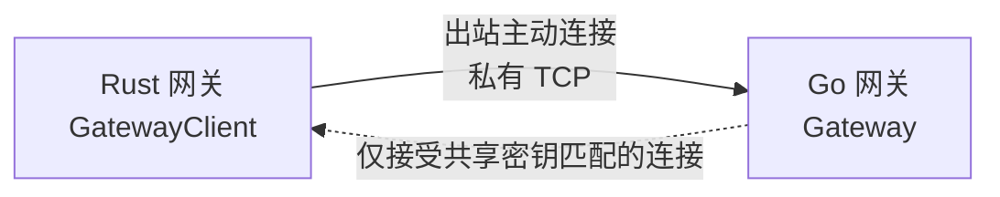
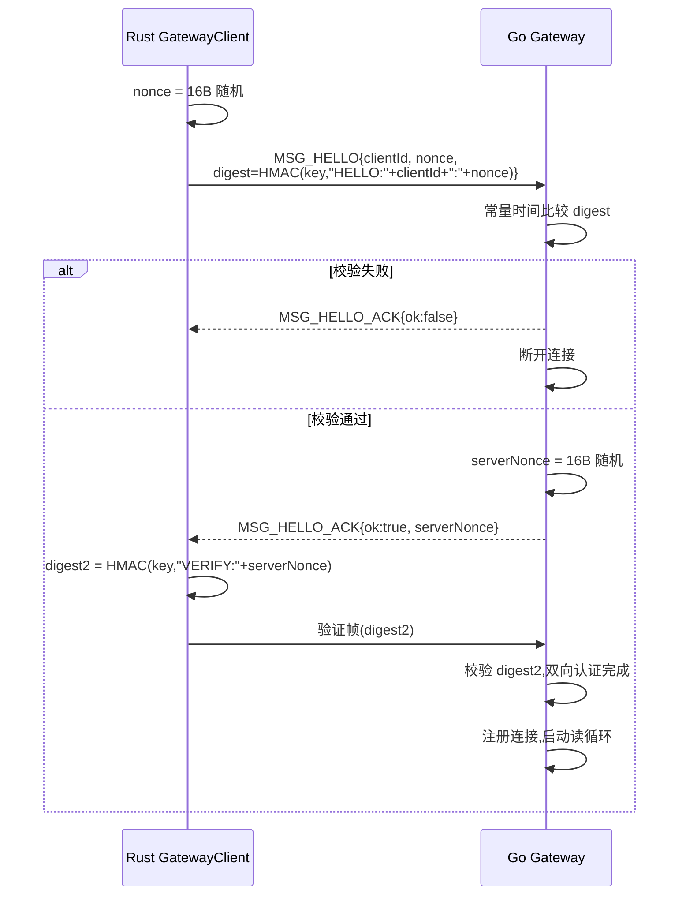
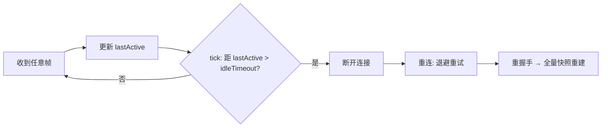
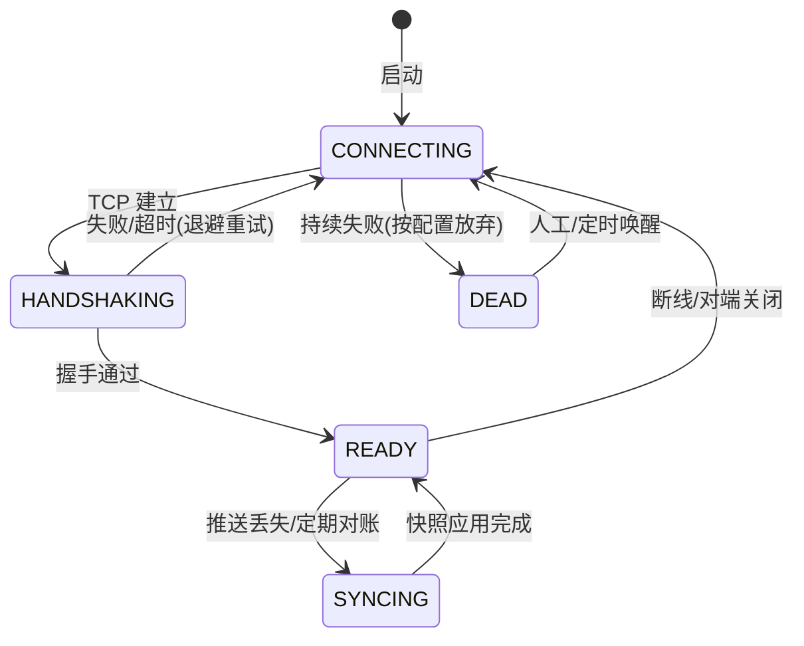
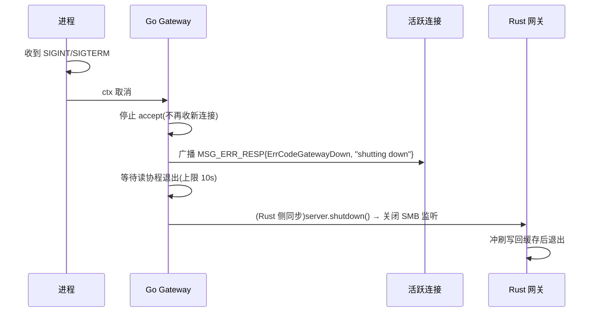

# SMB 网关设计文档 · 02 连接生命周期

> 覆盖:Rust→Go 私有 TCP 长连接的握手、心跳、断线重连、优雅停机与连接状态机。

## 1. 连接拓扑

- 方向固定:**Rust 为客户端,Go 为服务端**,Go 从不主动拨号;
- 地址:`config.yaml gateway.addr`(默认 `127.0.0.1:9001`),仅本机/内网可达;
- 认证:共享密钥(环境变量注入)+ 双向 HMAC 挑战应答;`shared_key_env` 留空时改为握手后动态协商随机密钥(后续实现)。

## 2. 握手流程(双向认证,防重放)

- 握手阶段读写超时 10s,防慢速攻击;
- 多实例:`clientId`(hostname+pid)用于隔离远程句柄表。

## 3. 心跳与空闲判定

| 参数 | 默认 | 说明 |
| --- | --- | --- |
| 心跳间隔 | 30s | 两侧各自定时发 MSG_HEARTBEAT(单向帧) |
| idleTimeout | 90s | 任一侧超过该时长无任何帧 → 判定对端死 |
| 重连退避 | 1s / 5s / 30s 封顶 | 断线后按此节奏重连,成功后重新全量快照 |

## 4. 断线重连(数据一致性兜底)

- 断线期间:pending 表全部应答投递 `ERR_GATEWAY_DOWN`(调用方收到后返回 SMB 错误,客户端可重试);
- 重连成功:立即全量快照(§04),弥补推送通道丢失的变更;
- 句柄表:远程句柄由 Go 侧管理,连接断开时 `CloseAllByConn` 回收(写回缓存落盘兜底)。

## 5. 优雅停机

- 先停新连接,再通知存量,最后等收尾;顺序错会导致写回数据丢失;
- Rust 侧 `sync_loop` 常驻任务随进程退出,重连逻辑只在存活期生效。

## 6. 维护注意

1. 修改超时/退避参数时两侧配置一起改(心跳间隔在 `config.yaml gateway.heartbeat_secs`);
2. 握手摘要格式 `"HELLO:"+clientId+":"+nonce` / `"VERIFY:"+serverNonce` 是**硬契约**,两侧必须一致;
3. 动态密钥协商(shared_key_env 留空)尚未实现,当前必须配置静态密钥。
