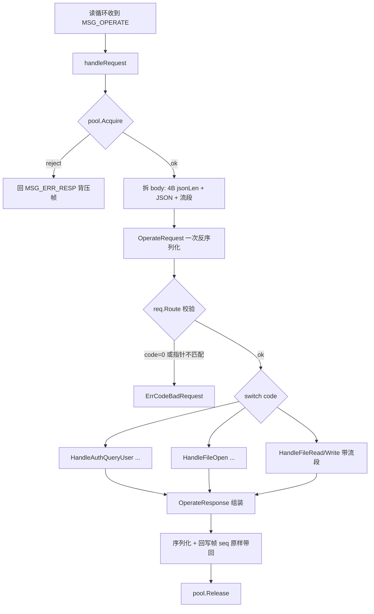

# SMB 网关设计文档 · 03 请求-响应流程

> 覆盖:一次 MSG_OPERATE 请求从 Rust 侧发出到 Go 侧返回的完整路径,含请求池背压与 pending 应答表。

## 1. 总体时序

```mermaid
sequenceDiagram
    participant S as Rust 业务层(remote_backend)
    participant C as GatewayClient
    participant W as writer 任务
    participant G as Go Gateway 读循环
    participant P as 请求池 AdmissionPool
    participant H as OperateHandler(Gateway)
    participant B as auth / files 业务

    S->>C: call(MSG_OPERATE, body)
    C->>C: seq=自增;pending[seq]=oneshot
    C->>W: 投发送缓冲管道(send_queue)
    W->>G: TCP 帧(Header{seq, MSG_OPERATE})
    G->>P: pool.Acquire(ctx)
    alt 池满(reject 模式)
        P-->>G: ErrTooManyRequests
        G-->>W: MSG_ERR_RESP{ErrCodeTimeout}(背压)
        W-->>C: oneshot 投递
    else 取得令牌
        P-->>G: ok
        G->>G: 拆 [4B jsonLen] + JSON → OperateRequest(一次反序列化)
        G->>H: req.Route(ctx, handler, stream)
        H->>B: 按操作码调用对应方法
        B-->>H: 结果/哨兵错误
        H-->>G: OperateResponse
        G-->>W: MSG_OPERATE_RESP([4B jsonLen]+JSON+[流段])
        W-->>C: oneshot 投递响应 body
    end
    C-->>S: Ok(响应body)/ Err(哨兵code)
```

## 2. Rust 侧:call 原语(pending 应答表)

```mermaid
flowchart TB
    subgraph call[call(msgType, body)]
        A[seq = fetch_add(1)] --> B[pending.insert seq → oneshot]
        B --> C[send_frame: 投发送缓冲管道]
        C --> D[await oneshot, 超时30s]
        D -->|Ok(body)| E[body 是 ErrorEnvelope?]
        E -->|是| F[Err(code)]
        E -->|否| G[Ok(body)]
        D -->|超时| H[Err(ERR_TIMEOUT)]
        D -->|连接断| I[Err(ERR_GATEWAY_DOWN)]
    end

    subgraph reader[reader 后台任务 常驻]
        R1[读帧头] --> R2[magic/version 校验]
        R2 --> R3[查 pending by seq]
        R3 -->|命中| R4[oneshot 投递 body]
        R3 -->|未命中| R5[丢弃+日志]
        R4 --> R1
    end

    subgraph writer[writer 后台任务 常驻]
        W1[从 send_queue 取帧] --> W2[独占写 TCP]
        W2 --> W1
    end
```

- **send_queue**:容量 = `config.yaml gateway.channel_buffer`(默认 1024);管道满时写入侧阻塞,背压自然传导(设计点 6);
- **pending**:`HashMap<seq, oneshot::Sender>`;响应帧按 seq 精确匹配,防串应答;
- **单向帧**(MSG_AUTH_PUSH / MSG_HEARTBEAT):seq=0,reader 识别后转交推送处理,不进 pending。

## 3. Go 侧:dispatch → Route(单次反序列化 + 操作码路由)



- **请求池**(设计点 6):`core.NewAdmissionPool(maxConcurrent, channelBuffer, AdmissionModeReject)`——并发上限 + 排队缓冲,池满快速拒绝,读循环永不阻塞;
- **错误分层**:
  - 业务错误 → `OperateResponse.err`(哨兵 code,不抛 Go error);
  - 路由/校验错误 → `ErrCodeBadRequest / ErrCodeNotImpl`;
  - 协议级 → `MSG_ERR_RESP`;
- **流数据段**:Write 请求的流段拆出后随 `Route` 传入 handler;Read 响应的流段由 gateway 组装在 JSON 之后。

## 4. 无结果操作(Flush/SetTimes/Truncate/Close/Unlink/Rename)

- 响应仅 `{code 回显, err: nil}`;
- Rust 侧校验 `resp.code == 请求 code` 且 `resp.err.is_none()` 即成功。

## 5. 维护注意

1. 新增操作码必须在 `Route` 的校验分支(唯一指针)与 switch 分支同步登记,漏一处 = 静默丢弃或误路由;
2. 响应帧必须带 `FlagResponse` 且 `seq` 原样带回,否则 Rust 侧 pending 永远等不到(30s 超时兜底);
3. `jsonLen` 与 `bodyLen` 的换算关系是硬契约:`dataLen = bodyLen - 4 - jsonLen`,负数直接判协议错误断开。
