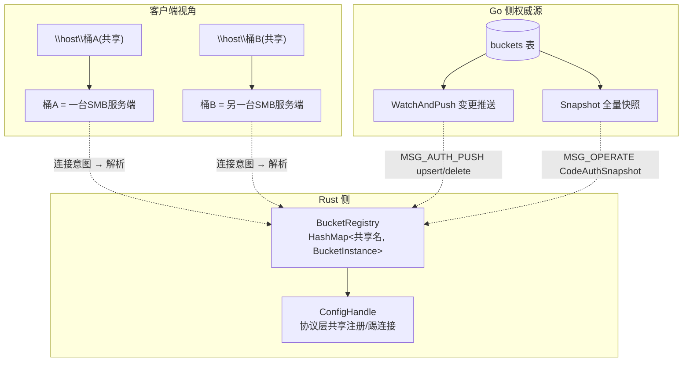
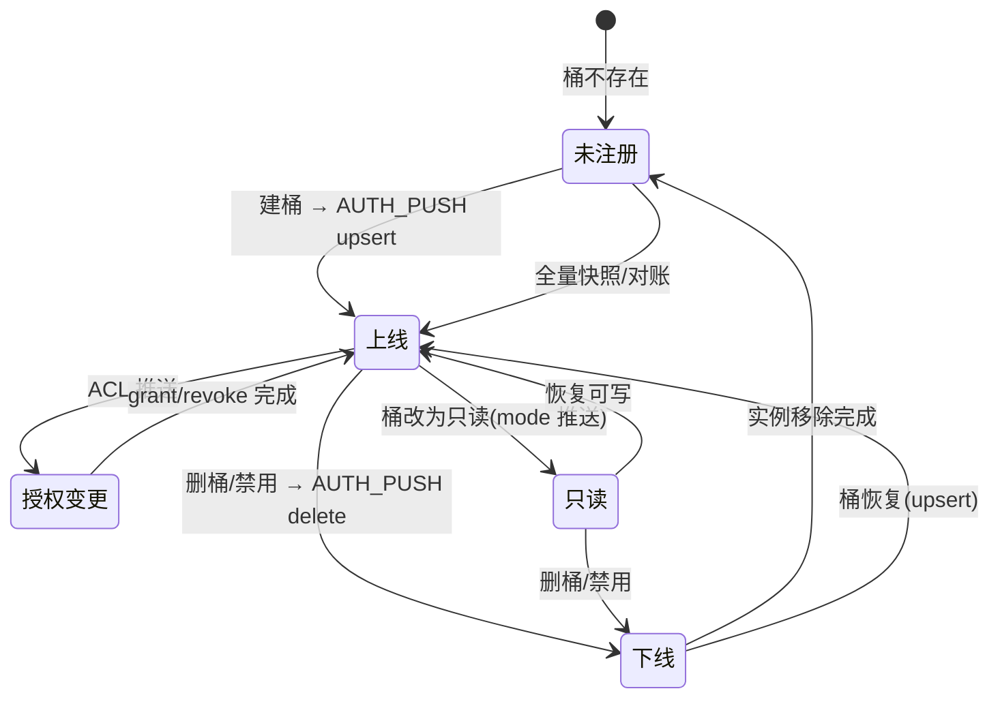
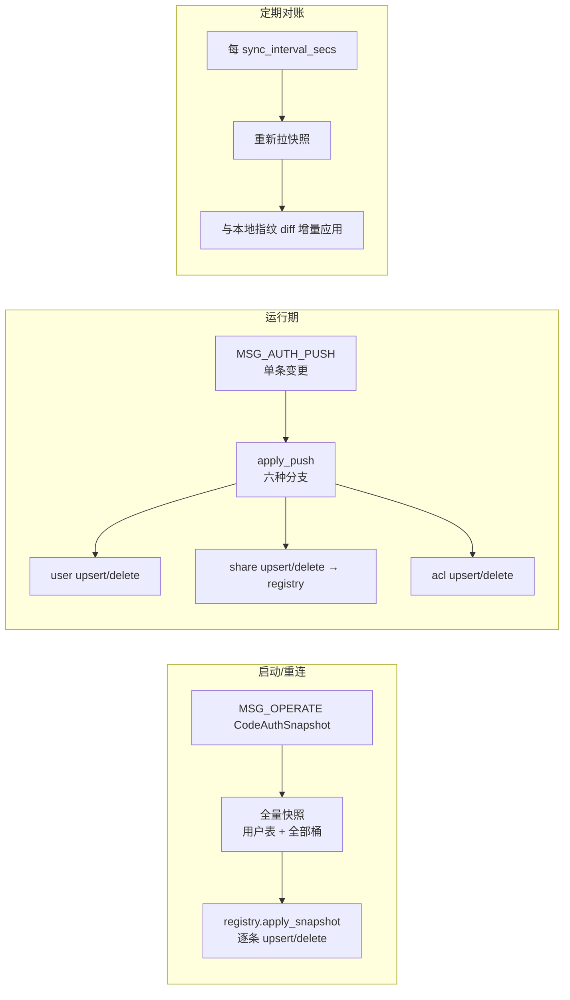
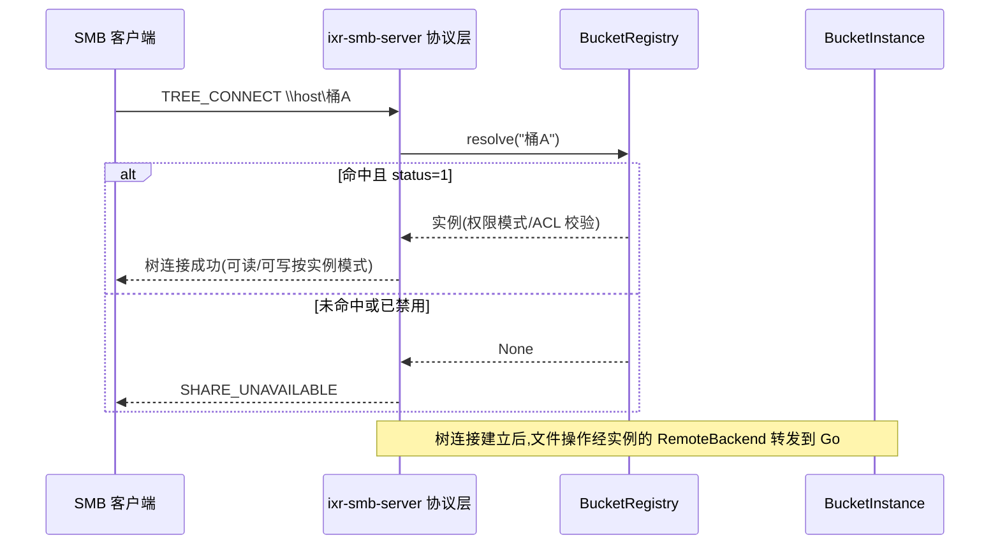

# SMB 网关设计文档 · 04 桶实例注册表与同步

> 核心设计:**一个桶 = 一台 SMB 服务端**。Rust 侧维护动态注册表(连接意图 → 实例),经 Go 网关推送/快照实时同步。

## 1. 概念模型

## 2. BucketInstance(一台"虚拟服务端"的运行时形态)

| 字段 | 含义 |
| --- | --- |
| share_name | 共享名(= 桶名;map 键,客户端连接意图) |
| bucket_id | 桶主键 ID(对象桶名 = BucketEncoder(id)) |
| bucket_name | 桶显示名 |
| mode | 共享级默认权限(readwrite/readonly) |
| users | ACL 用户清单(用户名 → Access) |
| quota / used_space | 桶配额/已用(FS_SIZE_INFORMATION 容量上报) |
| status | 1 正常 / 0 禁用(禁用 = 实例下线,拒绝 TREE_CONNECT) |
| backend | RemoteBackend(转发文件操作 RPC,携带桶上下文) |
| share | 已注册到 ConfigHandle 的库级 Share |

## 3. 同步状态机(桶生命周期)

- **上线(upsert)**:落表 → `ConfigHandle.add_share` → 对 users 逐个 `grant_share_user`(已有实例先 diff 撤销再授予);
- **下线(delete)**:逐个 `revoke_share_user` → `ConfigHandle.remove_share`(**库自动关闭该共享全部活跃树连接**)→ 移表;
- **授权变更**:`grant/revoke_share_user` 热更新(库自动关闭该用户对此共享的树连接,即时生效);
- 顺序约束:先删授权再删共享,防止 `UnknownUser/UnknownShare` 类错误。

## 4. 三种同步通道

| 通道 | 触发 | 作用 |
| --- | --- | --- |
| 全量快照 | 启动/重连/对账 | 建立权威基线,兜底推送丢失 |
| 增量推送 | 用户/桶/ACL 任何变更 | 实时热更新,无需重启 |
| 定期对账 | 每 `sync_interval_secs`(默认 60s) | 弥补推送通道丢失的变更 |

## 5. 连接意图解析(TREE_CONNECT)

- 协议层路由实际由 `ConfigHandle` 的 ShareBindings 表完成;注册表是**业务视图**(桶元数据/状态),两层在 upsert/delete 时保持同步。

## 6. 桶元数据 → SMB 语义映射

| 桶概念 | SMB 语义 | 实现 |
| --- | --- | --- |
| 桶根(虚拟根) | 共享根 | RemoteBackend 路径解析相对桶根(FolderID=0) |
| 桶权限/ACL | 树连接可读/可写 | TREE_CONNECT 授权 + 条目级可见性(Go 侧 visibility.go) |
| 桶配额/已用 | FS_SIZE_INFORMATION 容量 | quota/used_space 字段上报 |
| 桶删除/禁用 | 服务端下线 | remove_share + 踢活跃连接 |
| 桶可见性 | 客户端能枚举的共享 | QuerySharesForUser 过滤后只下发可见桶 |

## 7. 维护注意

1. 注册表与 ConfigHandle 是**两套表**,任何 upsert/delete 必须两边都落,漏一边会出现"业务视图有、协议层无"或反之;
2. 桶删除是异步清理:先 remove_share(踢连接)再后台清对象存储,顺序不能反;
3. `resolve` 只放行 status=1;禁用桶的实例可以留在表里(便于恢复),但必须拒绝新连接。
