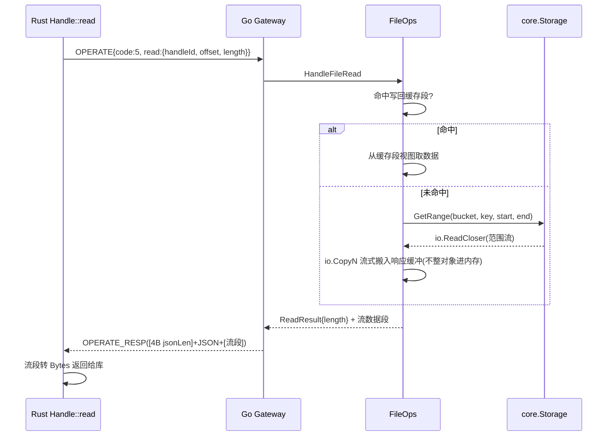
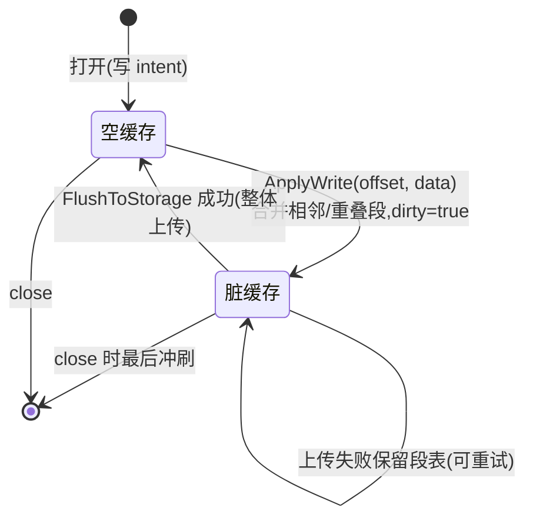
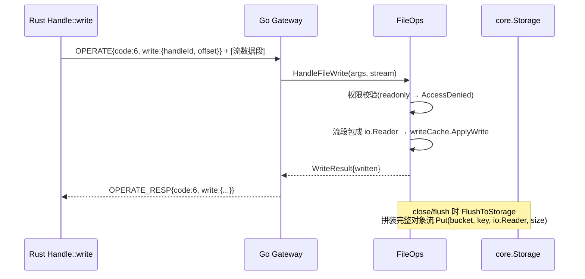

# SMB 网关设计文档 · 05 文件操作与流式数据

> 覆盖:open/read/write/list/unlink/rename/stat 的端到端路径、S3 随机写约束下的写回缓存状态机、Go `io.Reader` 与 Rust read/write 的协调。

## 1. 核心原则

- **块语义**:SMB2 单次 READ/WRITE ≤ 1MiB,一帧 = 一块,帧边界即数据边界;
- **控制面 JSON / 数据面流**:操作参数走总操作 JSON,文件数据走流数据段;
- **流式搬运**:块内用 `io.CopyN` 边读边写,不整文件进内存;大文件 = 多帧迭代;
- **写回缓存**:S3 不支持随机写,写入块先落内存段表,close/flush 整体上传。

## 2. 打开流程(CodeFileOpen)

```mermaid
sequenceDiagram
    participant S as Rust Handle::open
    participant G as Go Gateway
    participant F as FileOps
    participant DB[(folders/files 表)]

    S->>G: OPERATE{code:4, open:{path, intent, ...}}
    G->>F: HandleFileOpen
    F->>F: 路径解析(resolveSharePath)
    F->>DB: 沿 parent_id 链查目录;末级查文件
    alt 目录缺失且允许创建
        F->>DB: mkdir -p 建父链
    end
    F->>F: 按 intent 翻译(open/create/open_or_create/...)
    F->>F: 写权限校验(共享/条目 ACL)
    F->>F: 构造 remoteHandle + 登记 HandleRegistry
    F-->>G: OpenResult{handleId, isDir, endOfFile, exists}
    G-->>S: OPERATE_RESP{code:4, open:{...}}
```

- 句柄 ID 由 Go 侧 `HandleRegistry` 分配(全局唯一,连接断开时 `CloseAllByConn` 回收);
- 对象键 = 文件记录主键 ID;桶名 = `BucketEncoder(bucketID)`——Rust 侧不感知,Go 侧完成映射。

## 3. 读流程(CodeFileRead)——io.Reader 流式



## 4. 写流程(CodeFileWrite)——写回缓存



| 触发 | 时机 | 行为 |
| --- | --- | --- |
| SMB WRITE | 每次写入 | `ApplyWrite` 落内存段表(合并/覆盖),超 4MiB 阈值提前冲刷 |
| SMB FLUSH | 客户端显式 flush | `FlushToStorage`:原对象未覆盖区间 + 缓存段 → 拼装流 → `Put` 整体上传 |
| SMB CLOSE | 关闭句柄 | 最后冲刷;`delete_on_close` 时删对象 |
| 连接断开 | 句柄回收 | `CloseAllByConn` 兜底冲刷(失败记日志,一致性由重试兜底) |



## 5. 其它操作一览

| 操作码 | Go 侧落点 | 说明 |
| --- | --- | --- |
| 7 Flush | WriteBackCache.FlushToStorage | 触发整体上传 |
| 8 Stat | files/folders 记录 → FileInfo(FILETIME) | 叠加未冲刷缓存增量 |
| 9 SetTimes | 更新记录时间列 | FILETIME ↔ UTC 换算 |
| 10 Truncate | 记录 FileSize + 缓存截断标记 | Flush 时裁剪/零填充 |
| 11 ListDir | files+folders 表(可见性过滤) | 复用 server/visibility.go |
| 12 Close | 冲刷 + 注销句柄 | delete_on_close 走 unlink |
| 13 Unlink | 删记录 + 删对象(空目录同步删) | 非空目录 → NotEmpty |
| 14 Rename | 复用 server/file_copy_move.go | 目标存在 → Exists |

## 6. 两侧 IO 抽象对照

| 层 | Go | Rust |
| --- | --- | --- |
| 帧承载 | net.Conn(io.Reader/Writer) | tokio TcpStream(AsyncRead/AsyncWrite) |
| 数据面入口 | io.Reader / io.CopyN | Bytes / Vec<u8>(单块) |
| 存储 | GetRange→io.ReadCloser;Put 收 io.Reader | 不直连存储,全走 RPC |
| 上传复用 | 与 HTTP 上传共用 server 层签名 | 无对应(由 Go 侧完成) |

## 7. 维护注意

1. **一帧 = 一块**:Rust 侧不要把多块合并成一个大帧,也不要拆分单块(帧上限 16MiB,1MiB 块远低于上限);
2. 写回缓存与 files 表大小要一致:Flush 成功后必须更新 `FileSize`,否则 stat 与下载读到的长度对不上;
3. `io.CopyN` 必须按实际读到的长度截断,响应 Length 字段如实填写,0 = EOF;
4. 写权限校验在 Go 侧完成(共享 mode + 条目 ACL),Rust 侧只做能力声明(capabilities)。
