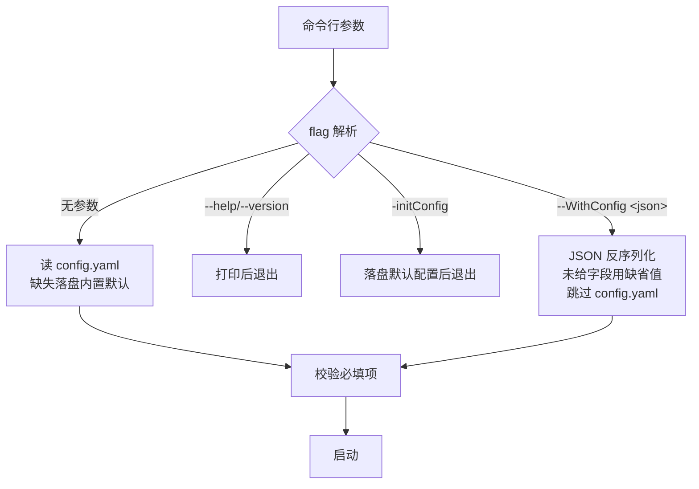

# SMB 网关设计文档 · 06 动态认证与配置

> 覆盖:用户/NT hash/ACL 的动态认证链路、配置项镜像、`-WithConfig` JSON 无配置启动、HTTP+SMB 双服务接线。

## 1. 动态认证(可行性报告 §3.2 级别 A)

### 1.1 两级认证路径

```mermaid
flowchart TB
    subgraph NTLM[每次 SMB 会话认证(本机完成,零 RTT)]
        C[SMB 客户端] -->|SPNEGO + NTLMv2| P[ixr-smb-server session_setup]
        P -->|查内存用户表 NT hash| T[(内存表 ConfigHandle.users)]
        T -->|命中| OK[会话建立]
    end

    subgraph 同步[用户/ACL 同步(后台,非认证路径)]
        G[Go 网关权威源 users/buckets 表]
        G -->|快照/推送| S[sync 模块]
        S -->|add_user/remove_user| T
        S -->|grant/revoke_share_user| ACL[(共享 ACL)]
        ACL -.撤销授权自动踢连接.-> P
    end
```

- NTLM 校验仍在 Rust 本机完成(内存用户表 + 预计算 NT hash),**性能无损**;
- 用户建/改/删、桶增删、授权变更实时生效,无需重启。

### 1.2 NT hash 约束(必须处理)

```mermaid
flowchart LR
    subgraph 密码设置[密码设置/修改时]
        A[明文密码] --> B[bcrypt 哈希 → users.password]
        A --> C[MD4(UTF-16LE) → NT hash]
        C --> D[users.nt_hash 列]
    end
    subgraph 下发[网关下发]
        D --> E[AclEntry user upsert]
        E --> F[Rust 内存用户表 NT hash]
        F --> G[NTLMv2 校验]
    end
```

- users 表存 bcrypt,**无法反推 NT hash**(NTLMv2 校验必须用 NT hash);
- 解法(Samba smbpasswd 同款):`users` 表新增 `nt_hash` 列,密码设置/修改时由明文计算,仅经网关下发;
- 不做 TDBSAM(网关持密钥)的复杂度升级,当前阶段不建议。

### 1.3 变更推送六分支(apply_push)

| Op / Kind | 动作 | 库行为 |
| --- | --- | --- |
| upsert / user | `add_user`(NT hash) | 更新内存用户表 |
| delete / user | `remove_user` | 自动 `close_sessions_for_user`(活跃会话即刻失效) |
| upsert / share | `registry.upsert` → `add_share` + 逐个 `grant_share_user` | 新桶立即可见 |
| delete / share | `registry.delete` → `remove_share` | 自动关闭该共享全部树连接 |
| upsert / acl | `grant_share_user` | 热更新授权 |
| delete / acl | `revoke_share_user` | 自动关闭该用户对此共享的树连接 |

## 2. 配置项(双侧镜像)

### 2.1 config.yaml(Rust 侧内置默认,include_str! 嵌入)

```yaml
smb:
  listen: "0.0.0.0:2445"        # SMB 监听地址
  netbios_name: "ORBITCLOUD"    # NetBIOS 名
gateway:
  addr: "127.0.0.1:9001"        # Go 网关地址
  shared_key_env: "ORBITCLOUD_SMB_GATEWAY_KEY"  # 密钥环境变量名(留空=握手后协商)
  heartbeat_secs: 30            # 心跳间隔
  sync_interval_secs: 60        # 全量对账周期
  channel_buffer: 1024          # 发送管道缓冲(与 Go 请求池队列对齐)
log:
  level: "info"                 # debug/info/warn/error
  output: "logs"                # 日志输出文件夹(空 = 仅控制台)
```

### 2.2 Go 侧(SMBGatewayConfig,真实现并入 OrbitCloud config 包)

| 字段 | 对应 config.yaml | 缺省 |
| --- | --- | --- |
| ListenAddr | gateway.addr(服务端监听) | 127.0.0.1:9001 |
| SharedKeyEnv | gateway.shared_key_env | ORBITCLOUD_SMB_GATEWAY_KEY |
| ChannelBuffer | gateway.channel_buffer | 1024 |
| MaxConcurrent | (Go 侧专有) | 64 |

## 3. 无配置启动(设计点 7:-WithConfig JSON 注入)



- 用途:调试/容器化/临时实例,不落盘敏感配置;
- 两侧都支持:Rust `parse_args` / Go `loadConfigFromJSON`(flag 包加 `-WithConfig`);
- JSON 字段名与 config.yaml 键对应(如 `{"smb_gateway":{"listen_addr":"...","channel_buffer":1024}}`)。

## 4. 双服务接线(设计点 8:HTTP + SMB 同属 API 层)

```mermaid
flowchart TB
    subgraph 主程序[根 main.go]
        PRE[flag.RunPreInit] --> INIT[appinit 初始化<br/>配置/日志/DB/存储/池]
        INIT --> FLAG[flag.Run]
        FLAG --> HTTP[HTTP 服务<br/>api.Router 协程启动]
        FLAG --> SMBGW[SMB 网关服务<br/>smbgateway 组件]
        HTTP --> SHUT[优雅停机<br/>双服务一起关闭]
        SMBGW --> SHUT
    end

    subgraph smbgateway[SMB 网关组件接线]
        AUTH[NewAuthService(db)]
        FILES[NewFileOpsService(core.Storage, registry)]
        POOL[NewAdmissionPool(maxConcurrent, channelBuffer, reject)]
        GW[NewGateway(listenAddr, key, pool, auth, files)]
        AUTH --> WATCH[go WatchAndPush 常驻]
        GW --> SERVE[go gw.Serve]
    end
```

- 主程序唯一入口是根 `main.go`;`smb_server/go` 不提供 `func main()`,只导出组件;
- 两个服务都属 API 层,统一调用 `server` 层包级函数(控制面 JSON / 数据面 io.Reader 流式)。

## 5. 维护注意

1. `nt_hash` 列迁移与密码流程改造是**首个真实现前置项**(可行性报告 §4.1,约 100 行);
2. 配置字段增删必须两侧同步(config.yaml ↔ SMBGatewayConfig ↔ core/enter.rs),校验规则(validate)同步;
3. 密钥环境变量名允许留空(动态协商)的设计已预留但未实现,当前必须配置静态密钥;
4. 双服务优雅停机顺序:先停 HTTP/网关 accept,再广播通知,最后关池与 DB。
